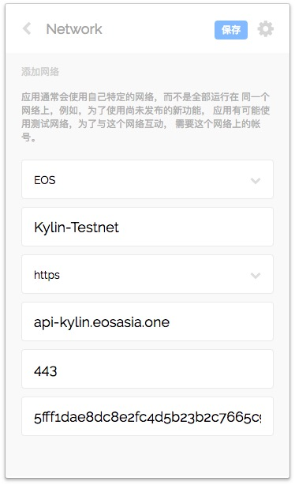
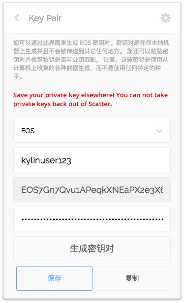
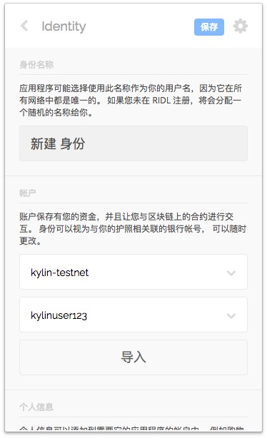
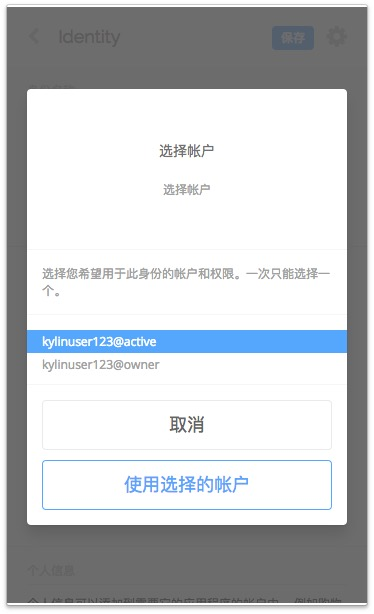

# 使用scatter在麒麟测试网发起交易


## 获得测试网账户

1. 申请账户，在浏览器地址栏中输入：http://13.125.53.113/create_account?new_account_name ，new_account_name换成你需要的账户，合法账户是12位长度，合法字符是a-z和1-5。注册失败可能是该用户名已经存在。成功后返回账户名和公私钥，记录下公私钥。
   
2. 获得测试网EOS余额，在浏览器地址栏输入：http://13.125.53.113/get_token?your_account_name ，your_account_name换成你的账户，可以获得100测试EOS。如果需要量比较大请联系管理员，不要重复多次调用这个地址。

## 配置scatter

### 1. 设置网络
打开scatter-设置（右上角的logo）-网络，点击新建，输入下面的配置，点击保存.
```
api-kylin.eosasia.one
EOS https 443
Chain ID:5fff1dae8dc8e2fc4d5b23b2c7665c97f9e9d8edf2b6485a86ba311c25639191
```


### 2. 设置密钥对

打开 scatter - 密钥对 - 新建 , 输入账户名备注和私钥，保存。
   


### 3. 添加身份

打开 scatter - 身份 - 新建 ， 选择网络和秘钥对，点击导入，选择导入的权限，建议使用active，点击保存。

 

## 发送交易

现在可以在 https://www.cryptokylin.io/ 中利用scatter签名发起各种交易，后续在测试网中测试的dapp也可以使用scatter接入。

